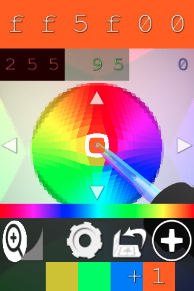

https://vidsbee.com/ColorPick/Mobile/

This will also compile into a:

 * ~99% working Mac OS app
 * ~99% working Linux app (for gtkmm-3.0 so far)
 * ~95% working/stable windows app (some errors observed)
 * ~IOS
 * ~Android
 * ~Emscripten [demo](https://qufighter.github.io/ColorPick/Mobile/WebDemo/index.html)
 * ... more?

Before you contribute, I suggest looking for forks of the project, to see if anyone else has move on with the work since I've left off.

Check the [README.md](external) in the "external" folder though for instructions to static link SDL and SDL Image libraries.

The windows visual studio project can be generated from CMAKE!  Have tested the llvm build too which is probably more stable (better threads and no cashes from using the worng free function, even though the one key feature won't work there it's not quite done yet from VS either, easy fix probably)

The mac OS project is the most up to date and is the most used development project.

Just read CMakeLists.txt for details...

Future work: probably won't be done
Future publishing: probably won't be done

TODO: bundling app bundles from cmake isn't working just yet, maybe someone can figure it out.  See add_subdirectory( cmake_install ) for details.

I do have a script to bundle up the osx app...

Just wanted to try to get this out there just in case!  You never know and I'm not getting the installs to ever reach those goals.

see todo for some work...

more TODO that are more on the top of mind:
1) move the 2 SDL library folders permanently into correct paths inside external folder
2) other bookkeeping and organizing (a new directory external_static is planned)(wip)

Hopefully someone in the future finds hte project useful or personal use or decides to continue development/code cleanup/etc!,
much love (and etc)

Sam

PS:

see also, the chrome extension src:
https://github.com/qufighter/ColorPick
